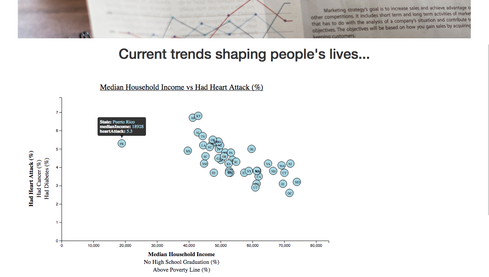

# Data Journalism
Welcome to the newsroom! We're going to analyze the current trends shaping people's lives, as well as create charts, graphs and interactives to help us understand our findings to be reported in the news. 

We are trying to assess the health risks facing particular demographics by sifting through the latest information from the U.S. Census Bureau and the Behavioral Risk Factor Surveillance System.

## Technologies used
This project builds custom interractive graphics using Data Driven Documents-D3.js, HTML, and CSS.

## Data Sources
**Demographic Data**

We looked for demographic information using the 2014 one-year estimates from the U.S. Census Bureau's American Community Survey using the [American FactFinder tool](https://factfinder.census.gov/faces/nav/jsf/pages/index.xhtml).

**Health Risk Data**

We used the data on health risks using 2014 survey data from the [Behavioral Risk Factor Surveillance System](https://chronicdata.cdc.gov/Behavioral-Risk-Factors/BRFSS-2014-Overall/5ra3-ixqq) by the Center for Disease control (CDC). 

## Analysis
We analyzed the following health factors of people in different states:
* % of people who have had a Heart Attack
* % of people who have had Diabetes
* % of people who have had Cancer

We analyzed the health risks based on the following parameters:
* Median Household Income in the states
* % of people with no High School Graduation
* % of people 200% above the Poverty Line

 We analysed the above parameters to see the trends shaping people's lives. We show some of the health risks that occur in people with certain demographics as listed above. 
 
 We see that higher Median Household Income fewer the percentage of people that have had heart attacks or diabetes. However Median Income does not seem to affect the percent of people having Cancer as much. This might be because of the ability to get good preventive health care and lead a healthier lifestyle with the high incomes. 
 
 We also see that as the percentage of people with No High School Graduation increases, the percentage of people having heart attacks and diabetes also increases but it doesn't really affect Cancer as much. This shows that with more education there is more health awareness and also more income leading to better preventive care and lifestyle which again verifies our analysis above. 
 
 Lastly we also see a similar trend with the percentage of people being 200% above the poverty line. With more percentage of people above the poverty line, there is a fewer percentage of people with heart attacks and diabetes, however it does not affect the p ercentage of people with cancer as much. This also verifies out analysis above. 
 
 You can try all the combinations in the graph in our project page linked below and see for yourself how the various demographics parameters affect the health risks. Just click on the axis label to choose your parameter.

## Sample Page
Take a look at the resulting html page : 
[https://rupalimayekar.github.io/DataJournalism/](https://rupalimayekar.github.io/DataJournalism/)

## References
* Image credits : Photo by rawpixel.com from [Pexels](https://www.pexels.com/)
* Data Sources : 
    * [US Census Bureau](https://www.census.gov)
    * [Center for Disease Control](https://chronicdata.cdc.gov)

            

